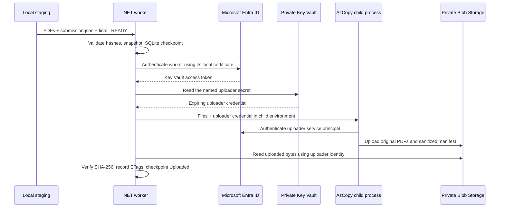

# Stage D — real credentials and private upload

Stage D is complete. It replaces the simulated credential/upload stages with real Azure operations and intentionally ends at **Uploaded**, before classification, OCR, LLM extraction or Cosmos persistence. Four synthetic submissions produced 28 blobs (24 PDFs and four manifests), verified by read-back hashes and final inventory. The Stage B simulation remains available in its separate runtime.

## What happens automatically



The VPN carries the private Key Vault and Blob data paths. Entra authentication still uses its normal public HTTPS endpoints. Private service access does not mean all network traffic is private or that the internet is unnecessary.

The worker uses `ClientCertificateCredential` explicitly. It has no Azure CLI/developer-login fallback. Your operator login was used only to provision the identities, roles and secret and to perform setup-time audits.

## Identities and permissions

| Identity | Credential | Assigned access |
|---|---|---|
| `bmg-poc-worker-wjsvyjg25vqiy` | Separate seven-day non-exportable `BMG-POC-Worker` certificate in CurrentUser\My | Key Vault Secrets User at the single `bmg-uploader-client-secret` secret scope |
| `bmg-poc-uploader-wjsvyjg25vqiy` | Twelve-hour client secret stored in Key Vault | Storage Blob Data Contributor at the `submissions` container scope |

`identity-inventory.json` records exact application IDs, service-principal IDs, worker certificate thumbprint, secret version identifier and expiry. It contains no private key, access token or secret value. The two apps are single-tenant and request no Microsoft Graph API permissions. Azure RBAC provides their resource permissions.

The temporary Key Vault Secrets Officer assignment used to initialize the secret was removed and its absence was checked live. The operator's earlier Stage C verification roles still exist on the POC resources; this worker does not use them.

The uploader's built-in contributor role includes delete permission within its container, although this implementation never invokes delete and passes `--overwrite=false`. This is container-scoped access, not a custom upload-only role. A later production design can use a narrower custom role if required. The worker intentionally obtains the uploader credential, so these identities are not a security boundary against a compromised worker; their effective access remains limited to the named secret and submission container.

The Key Vault secret expiry and Entra password expiry are aligned. Credential expiry blocks new authentication; it is not instant revocation of an already issued token. The worker rejects expired/near-expiry secrets. Certificate replacement, secret rotation and token revocation require their own tested operational procedures.

## Run the live demonstration

Keep `vnet-bmg-poc` connected. Open PowerShell in the BMG project directory and run:

```powershell
.\prototype\scripts\Start-AzureUploadWorker.ps1
```

In a second PowerShell terminal in the BMG project directory:

```powershell
.\prototype\scripts\Submit-AzureSynthetic.ps1 -Sample 1
```

The helper accepts samples 1–5. It gives PDFs neutral filenames, writes a runtime manifest without document classes, and writes `_READY` last. It does not read expected-answer metadata or create simulation fixtures. The default submission ID is unique; use an explicit new revision for revised content.

The worker receives the event, validates and snapshots the package, retrieves credentials, uploads, verifies bytes and stops that job at **Uploaded**. It continues watching for further submissions until Ctrl+C. There is no per-document permission prompt.

For one pass, status or identity checks:

```powershell
.\prototype\scripts\Start-AzureUploadWorker.ps1 -Once
.\prototype\scripts\Start-AzureUploadWorker.ps1 -StatusOnly
.\prototype\scripts\Start-AzureUploadWorker.ps1 -VerifyIdentity
```

An exit code of 0 means all accepted jobs reached this stage's **Uploaded** checkpoint and no intake issues remain. It does not mean the end-to-end POC reached step 10. The original `Start-LocalWorker.ps1` still runs simulation.

Runtime paths:

- Live Stage D: `C:\Users\shrut\Documents\BmgPocRuntime\stage-d`.
- Configuration: `C:\Users\shrut\Documents\BmgPocRuntime\azure\stage-d-config.json` (IDs, endpoints, paths and pinned AzCopy hash; no secret value).
- Upload receipts: `stage-d\snapshots\<digest>\azure-upload.json`.
- Credential receipts: `stage-d\snapshots\<digest>\azure-credential.json` (identity IDs and secret version/expiry only).
- State and logs: `stage-d\state\intake.db`, `stage-d\logs\worker.jsonl`.
- AzCopy job plans: `stage-d\azcopy`; raw child stdout/stderr is drained without being saved, and AzCopy text logging is disabled.

Blob paths are `submissions/<submissionId>/r<revision>/<manifestDigest>/<filename>`. Each normal sample uploads six PDFs and the canonical manifest. No `_READY` marker, expected-answer file, classifier label, secret receipt or local database is uploaded.

## Integrity and recovery

The accepted local snapshot is checked before cloud work. The worker requires both service hostnames to resolve into the planned private endpoint subnet. Normal HTTPS certificate validation remains enabled. The AzCopy executable is checked against the hash saved at setup, and it is launched without a shell or window.

Before each upload, existing destination content is read and SHA-256 checked. Different content under the exact destination is rejected as `RemoteContentConflict`. Matching content is reused. New objects are uploaded with `--overwrite=false`, length checking and stored MD5, then their actual bytes are read back and SHA-256 checked. An ETag condition binds a read to the version whose properties were checked. ETags and hashes are recorded before the durable SQLite Uploaded checkpoint.

A process crash after cloud upload and before the checkpoint can replay safely: the new process reads the secret again, verifies already present blobs, and advances the checkpoint. This does not require the original staging folder. The live crash test verified unchanged ETags for all seven blobs after recovery.

The local SQLite ID/revision constraint is per runtime. It is not yet a cross-host/global submission registry. The runtime is bound to its mode, destination and identities, so simulation cannot silently continue an Azure job. The worker writes no final metadata result or completion receipt at this intermediate checkpoint.

Transient I/O, private DNS and retryable Azure failures use the existing durable four-attempt policy. Azure SDK operations may themselves retry twice within a worker attempt. AzCopy has a three-minute process timeout and is terminated on cancellation. Authentication, authorization and content conflicts produce explicit terminal exceptions; resolve the issue and use an explicit new revision where required. Do not edit SQLite rows to hide failed history.

## Verification

- Build: .NET SDK 10.0.401, zero warnings/errors, locked dependencies.
- Azure packages: Azure.Identity 1.21.0, Azure.Security.KeyVault.Secrets 4.11.1, Azure.Storage.Blobs 12.29.2.
- AzCopy: pinned existing version 10.32.7.
- **21/21** existing simulation regression tests passed after the worker changes.
- **6/6** live acceptance tests passed: real upload/read-back and replay; crash recovery without blob rewriting; readiness gating; damaged input rejected before cloud access; simulation-mode rejection for an Azure runtime; folder drop driving unattended real upload.
- **6/6** identity checks passed: named-secret access; submissions-container access; worker denied another secret; worker denied Blob; uploader denied Key Vault; uploader denied training container.

`azure-upload-results.json`, `simulation-regression-results.json`, `identity-verification.json`, `role-assignments.json`, and `setup-permission-cleanup.json` contain the evidence. The live test suite uploads three synthetic submissions. The separate user-facing demo `stage-d-demo-001` also succeeded and is recorded in `demo-upload-receipt.json` and `verification-summary.json`. Its worker has stopped. Use the helper's automatically generated ID for another demo rather than repeating that explicit ID.

`secret-persistence-audit.json` records an exact-value scan of 150 named local test/runtime/evidence files, including AzCopy job plans, with zero matches for plaintext UTF-8, UTF-16 and URL-encoded secret values. It does not inspect OS memory, the pagefile or encrypted credential caches. A child environment is safer than a command-line secret but is still accessible to suitably privileged local processes. No guarantee of memory zeroization is made.

## Teardown and next checkpoint

The cloud session remains the one started during Stage C; this stage does not reset its cost clock. Networking continues until deletion, and the 10:59 PM IST reference expiry on 11 September is not an automatic deletion schedule.

At final POC teardown, export evidence and stop the worker. Preview the separate identity cleanup with:

```powershell
.\infra\scripts\Remove-StageDIdentities.ps1
```

Use `-Delete` only when the POC is finished. The script validates the exact recorded applications and the dedicated worker certificate before removing them. Verify the associated service principals are also gone after directory deletion propagates. Remove the POC resource group using the Stage C teardown procedure to remove its vault, secret and scoped roles. The VPN profile/certificates and automatically created East US 2 Network Watcher remain separate Stage C cleanup items. Do not delete other applications or certificates.

The next stage is document classification/OCR preparation and integration. No classifier, LLM deployment, extraction prompt, training storage exception or Cosmos write is claimed by this checkpoint.

## Official references

- [AzCopy service principal authorization](https://learn.microsoft.com/en-us/azure/storage/common/storage-use-azcopy-authorize-service-principal)
- [AzCopy copy options](https://learn.microsoft.com/en-us/azure/storage/common/storage-ref-azcopy-copy)
- [Certificate credentials in Microsoft identity platform](https://learn.microsoft.com/en-us/entra/identity-platform/certificate-credentials)
- [Key Vault RBAC](https://learn.microsoft.com/en-us/azure/key-vault/general/rbac-guide)
