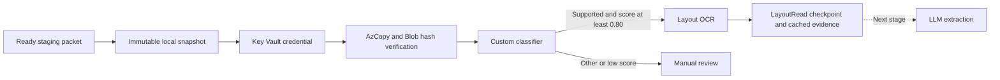

# Stage E — classifier training and OCR

Status: COMPLETE. Classifier training, held-out evaluation, live crash recovery and drop-folder watcher checks passed. Processing is stopped. Stages F onward remain unstarted.

## Scope and controls

Stage E extends the real worker from `Uploaded` to `Classified` and then `LayoutRead`. A ready local packet is snapshotted, its uploader credential is read from Key Vault, AzCopy uploads verified bytes, Document Intelligence classifies each PDF, and the Layout model produces OCR evidence. The worker stops at `LayoutRead`; it does not call an LLM, write application metadata to Cosmos, or return a final result.

The new mode is `--azure-documents`; it has a separate runtime at `C:\Users\shrut\Documents\BmgPocRuntime\stage-e`. The configuration at `C:\Users\shrut\Documents\BmgPocRuntime\azure\stage-e-config.json` contains service names and identity identifiers only. Its hash binds the runtime to the selected model, identities, destinations, threshold and page budgets. Stage B simulation and Stage D upload-only remain separate modes.

## Training versus inference

The model is a Document Intelligence custom classifier, `bmg-stage-e-v1`, API `2024-11-30`. Its classes are Note, DeedOfTrust, TitleCommitment, Survey, ClosingInstructions, Rider and Other. This is supervised classification: document-level labels teach a service to recognize classes. This stage does not fine-tune an LLM or train custom field-extraction models. Layout is Microsoft's prebuilt OCR/layout model; there is no local training of its weights.

The frozen manifest is `work/stage-e/dataset/manifest.json`. This initial iteration deliberately reduces the Stage A target of 120 training/60 evaluation PDFs to 70 training/28 evaluation PDFs across seven classes, conserving preparation time and calls while testing the mechanism. There are ten training and four evaluation documents per class. The split contains 77 training pages and 35 evaluation pages. It includes scanned PDFs and two-page documents. Training and evaluation use different layout variants, names and loan IDs. Class vocabulary and substantial document prose are shared; these are simple synthetic fixtures, not a rigorous estimate of client-document performance. Production validation needs a much larger, representative, independently held-out client corpus.

Training labels and gold values stay in the dataset manifest and training folder structure. Staged inference files have neutral names and a manifest containing only IDs, file hashes and whitelisted trigger metadata. The worker never reads the dataset manifest, label folders or gold values.

The fixed 0.80 threshold was chosen before evaluation. Each PDF represents one document, including multipage PDFs; the REST parameter is `split=none`. Unsupported classes and confidence below the threshold become `ClassificationRequiresReview`. One unsupported document holds the packet for review before OCR; a single-file evaluation packet makes individual results visible. Other is a sampled negative class, not a guarantee that every unfamiliar input will be detected. Confidence is a model score, not a calibrated probability.

## Network and identity lessons

The laptop reaches Blob Storage, Key Vault and Document Intelligence through the existing P2S VPN and private DNS. Entra token acquisition still uses Microsoft's public identity endpoint. Authentication, RBAC and network reachability are separate controls: a token does not bypass the storage firewall, and a VPN connection does not grant data permissions.

The worker uses its nonexportable certificate and dedicated Entra application. Stage E adds Cognitive Services User scoped only to the POC Document Intelligence resource. Its existing secret-level Key Vault permission and the separate uploader's submissions-container permission remain unchanged. No service keys, SAS tokens or Owner credentials are used by the worker.

Training has an additional service-to-storage connection. The operator temporarily receives training-container Blob Data Contributor to upload the corpus. A container-scoped role for Document Intelligence's system identity produced `ContentSourceNotAccessible`; the successful attempt used the documented storage-account Blob Data Contributor scope, only on this POC account, plus a propagation interval. This broader training permission was removed after training. During the classifier build, storage used public network access Enabled with default Deny, bypass None, no IP/VNet allowlist, and a resource-instance exception for this DI resource only. Public anonymous blob access and shared keys stayed disabled. This training exception is not an end-to-end private-link path. The final runtime uses public network access Disabled with that exception removed. Firewall/RBAC propagation and scope are separate variables; the successful retry does not prove which caused the previous failure.

The first build failed with `TrainingContentMissing`: uploading PDFs alone does not prepare an API-based classifier dataset. The REST Layout response must also be saved beside every PDF as `<filename>.ocr.json`, using the same API version as training. Studio ordinarily orchestrates that preprocessing; our scripts do it explicitly and cache each operation. This consumes Layout pages. The initial cleanup also revealed that ARM PATCH preserves an omitted resourceAccessRules collection: restore it with an explicit empty array, then verify it. The public-access-disabled setting was restored before that residual rule was removed.

## Durability and billing boundaries

PdfPig 0.1.16 checks parsing, encryption and a 20-page PDF limit before credentials/upload/AI processing. Existing byte, manifest and SHA-256 checks still apply. This is not a malware scanner.

SQLite stores AI request intent before a billable POST, then the returned operation URL and complete successful result. A retry with a known operation polls it; a successful result is reused. An interrupted POST with no recorded operation URL becomes `AiSubmissionOutcomeUnknown` and requires review, avoiding blind duplicate billing. HTTP rejection is conservatively terminal; transient polling/network failures use the existing bounded retry mechanism. Unknown, rejected and failed requests still consume the local reserved-page budget conservatively.

The current runtime permits at most 120 classification pages and 120 Layout pages. These limits apply to this runtime database, not the whole subscription. Training preprocessing has a separate frozen 77-page inventory. Creating another runtime creates a separate ledger; overall usage must be reconciled across ledgers before more experiments. Cached result JSON includes original OCR content, pages, words, confidence and geometry for later evidence checking. OCR content stays in snapshots/SQLite rather than operational logs. SQLite itself is not independently encrypted; this laptop's user permissions and disk protection govern local storage.

## Commands

From the project root:

```powershell
.\prototype\scripts\Start-AzureDocumentWorker.ps1
.\prototype\scripts\Start-AzureDocumentWorker.ps1 -Status
.\prototype\scripts\Start-AzureDocumentWorker.ps1 -Once
```

The first command stays running and watches `C:\Users\shrut\Documents\BmgPocRuntime\stage-e\staging`. A submission needs its PDF files, `submission.json` and `_READY` written last. Stop a foreground worker with Ctrl+C. Existing terminal review cases mean a one-shot run can exit 2 even when later good packets succeed; inspect per-job status.

To reproduce training in the existing POC foundation: generate the corpus with `generate_stage_e.py` only if its frozen manifest does not already exist, then run `train_stage_e.py` using the bundled Python. The training script grants temporary roles, uploads and hash-verifies PDFs, invokes `prepare_stage_e_layout.py` for cached or new OCR sidecars, builds the classifier, and restores restrictions. Its cloud IDs are deliberately pinned to this POC. After resource teardown/recreation, reconcile old operation records and validate the new resource inventory before running it again; an old operation URL is not a model backup. Do not blindly restart an uncertain training/analysis POST. Inspect its recorded operation first.



## References

- [Classifier preparation and Layout sidecars](https://learn.microsoft.com/en-us/azure/ai-services/document-intelligence/how-to-guides/build-a-custom-classifier?view=doc-intel-4.0.0)
- [Classifier REST API and split parameter](https://learn.microsoft.com/en-us/rest/api/aiservices/document-classifiers/classify-document?view=rest-aiservices-v4.0%20(2024-11-30))
- [Managed identities and restricted training storage](https://learn.microsoft.com/en-us/azure/ai-services/document-intelligence/authentication/managed-identities-secured-access?view=doc-intel-4.0.0)

## Final verified results

28/28 held-out documents had the correct top label. At the frozen 0.80 threshold, 19/24 supported documents passed automatically (79.2% coverage), five went to review, and 4/4 Other documents went to review; zero false accepts in this small synthetic set. OCR found 38/38 checked anchors. This is not a production accuracy or field-extraction guarantee.

The original supplied packet received Survey as all six top labels (only one correct), with confidence 0.122–0.785; all six were held for review. This shows poor generalization beyond the generated templates. Recovery was therefore tested with a previously evaluated supported synthetic packet; this is integration evidence, not additional independent accuracy evidence. Crash recovery reused the recorded AI results with zero additional AI requests. A packet dropped after the watcher started automatically reached LayoutRead; the watcher was then stopped. The 21 regression, five safety and seven identity checks passed. Final Azure checks confirmed private-only storage, no temporary DI training roles, no OpenAI deployments and no compute resources to stop. SQLite was backed up after processing stopped. See verification-summary.json for request/page totals and all terminal job states.
